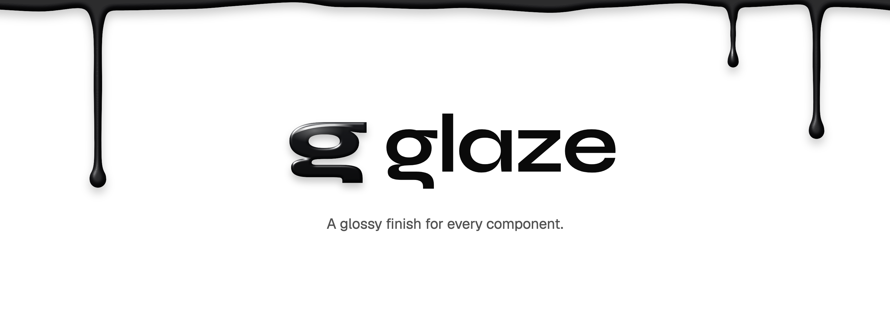

<picture>
  <source media="(prefers-color-scheme: dark)" srcset=".github/assets/glaze-banner-dark.png">
  
</picture>

My component library: shadcn/ui on Base UI, themed entirely through tokens. A Vite monorepo with the library, a web app and Storybook.

**Architecture:** layers, token contract, theming and component rules are specified in `/Users/amitka/Personal/SharedContext/workflow/comp-lib-architecture.md`. Read it before changing components, tokens or themes.

## Using Glaze in a project

### 1. Install

```bash
npm install @amit-kap/glaze
```

React 19 and Tailwind CSS 4 come from your project. Each release is also tagged in this repo, so `npm install github:amit-kap/glaze#v<version>` works too.

### 2. Import the styles and a theme

In the project's main CSS file:

```css
@import "@amit-kap/glaze/globals.css";
@import "@amit-kap/glaze/themes/maia.css";
```

- `globals.css` holds Tailwind, the tokens and the default theme, Nova. Use it in place of your own `@import "tailwindcss"`.
- Import only the themes you use. Each one brings its own font.
- Tailwind finds the classes inside Glaze's components on its own; your project's files are detected as usual.

### 3. Turn the theme on

In React, wrap the app in `ThemeProvider`:

```tsx
import { ThemeProvider } from "@amit-kap/glaze/theme"

<ThemeProvider defaultTheme="maia" defaultMode="system">
  <App />
</ThemeProvider>
```

`defaultTheme` defaults to `"nova"`. The viewer's choice is remembered in `localStorage` (`storageKey`, default `"glaze"`; `false` to turn it off).

Without React, set the attribute yourself: `<html data-theme="maia">`.

### Switching at runtime

```tsx
import { useTheme } from "@amit-kap/glaze/theme"

const { theme, setTheme, mode, setMode, resolvedMode, density, setDensity } = useTheme()
setTheme("lyra")
setMode("dark")        // "light" | "dark" | "system"
setDensity("compact")  // "comfortable" | "compact"
```

### No flash on load

Add the inline script to `<head>` so the saved theme applies before the page paints. Pass the same options as the provider:

```tsx
import { themeScript } from "@amit-kap/glaze/theme"

<script dangerouslySetInnerHTML={{ __html: themeScript({ defaultTheme: "maia" }) }} />
```

### Switches

All three go on `<html>` and combine freely:

| Switch | Set with | Values |
|---|---|---|
| Theme | `data-theme` | none or `nova` (default), `vega`, `maia`, `lyra`, `mira`, `luma`, `sera`, `rhea`, or your own |
| Mode | `class="dark"` | none (light), `dark` |
| Density | `data-density` | none / `comfortable`, `compact` |

```html
<html data-theme="maia" class="dark" data-density="compact">
```

`ThemeProvider` sets these for you. The same attributes work on any element to theme just that part of the page:

```html
<section data-theme="sera">…</section>
```

### Themes

| Theme | Character |
|---|---|
| `nova` (default) | Geist, 32px controls, 10px corners |
| `vega` | Inter, taller controls, tighter corners |
| `maia` | Figtree, pill controls, round menus, deep shadows |
| `lyra` | JetBrains Mono, square, small type |
| `mira` | Inter, compact controls, small type |
| `luma` | Inter, pill controls, very round cards, lifted shadows |
| `sera` | Taupe, Noto Sans + Playfair Display headings, square, tall controls |
| `rhea` | Inter, soft rounded controls and cards |

### Your own theme

Create `<name>.css` (in the library's `packages/ui/src/styles/themes/`, or in the project), set the required inputs (`--canvas`, `--surface`, `--ink`, `--brand`, `--radius`, …) for light and dark under `[data-theme="<name>"]`, import it, and use `data-theme="<name>"`. The input list and a template are in the spec's "Writing a theme" section.

### Components

```tsx
import { Button } from "@amit-kap/glaze/components/button"
```

## Developing Glaze

### Adding components

```bash
npx shadcn@latest add button -c apps/web
```

This places the component in `packages/ui/src/components` with stock shadcn classes. Convert it to Glaze tokens and check:

```bash
npm run convert:tokens -- button.tsx   # stock classes → system utilities
npm run check:tokens                   # fails on any class the token contract forbids
```

Anything the converter can't map becomes a component token (see the spec's "Converting stock shadcn code").

### Releasing

```bash
# 1. bump "version" in packages/ui/package.json and commit
npm run release:glaze -- --push --npm   # build, tag v<version> on the release branch, push, publish to npm
```

`--npm` asks for your npm 2FA code. The published package gets its own README (`packages/ui/PACKAGE_README.md`) and `THIRD_PARTY_NOTICES.md`; keep the package README in step with this one. `npm run build:glaze` builds `packages/ui/dist` without releasing. npm installs a git repo's root, so releases live on the `release` branch, which holds only the built package.

### Showcase

`apps/showcase` is a one-page demo of Glaze in the style of fluidfunctionalism.com: a centre column of live components, and a floating settings panel (Theme / Mode / Density) at the top right.

```bash
npm run dev -w showcase     # http://localhost:5180
```

### Storybook

Every component in `packages/ui` has a story in `apps/storybook/src/stories`.

```bash
npm run dev -w storybook    # http://localhost:6006
npm run build -w storybook  # static build in apps/storybook/dist
```

The toolbar has the three switches: **Theme**, **Mode** and **Density**. Link to a state with `&globals=theme:maia;mode:dark;density:compact`. Test themes that shouldn't ship go in `apps/storybook/src/themes`; they appear in the Theme switch but aren't part of the package.

When you add a component, add a matching `<component>.stories.tsx`.
